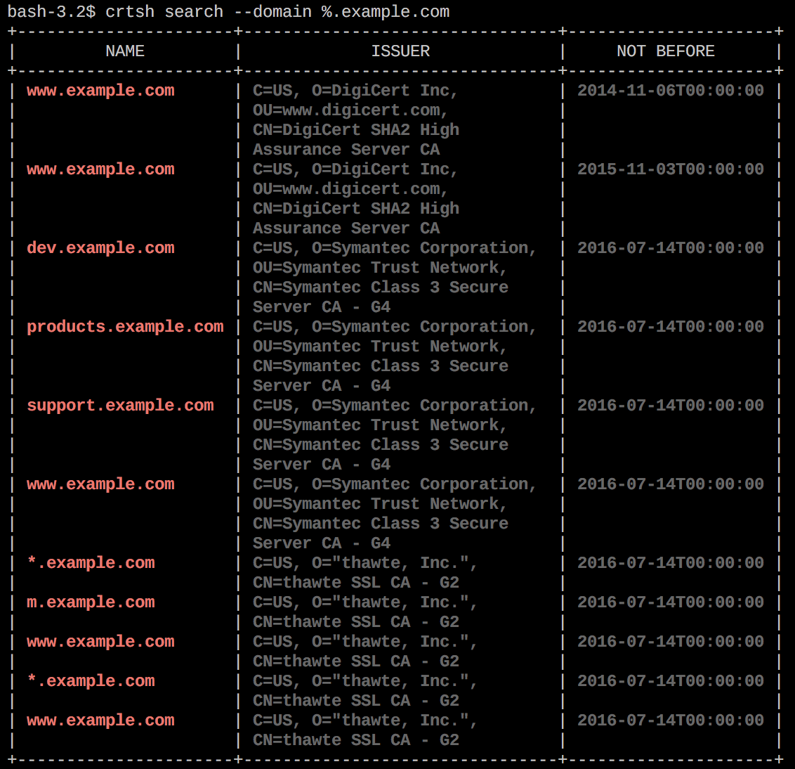
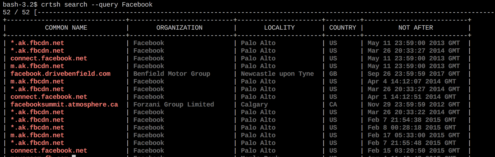

# crtsh
API client for crt.sh by [@knqyf263](https://github.com/knqyf263/crtsh) @knqyf263 didn't merage pull request of [@jannickfahlbusch](https://github.com/jannickfahlbusch) , So I created new repo for the fixed version.

Thanks [@knqyf263](https://github.com/knqyf263/) and [@jannickfahlbusch](https://github.com/jannickfahlbusch)


`crtsh` allows to get the information about a HTTPS website.  
e.g. Search subdoimains.

This tool uses Certificate Transparency logs.
For more information, check https://crt.sh/

## Example
### Subdomains
Search subdomains of `example.com`



### Organization
In `--query`, `%` can be used as wildcard.




## Install

### Source
```
$ go get -u github.com/rudSarkar/crtsh-by-knqyf263
```
### Manually Install
1. `git clone https://github.com/rudSarkar/crtsh-by-knqyf263`
2. `cd crtsh-by-knqyf263`
3. `go build`
4. `./crtsh`


## Usage

```
% crtsh -h
crtsh client

Usage:
  crtsh [command]

Available Commands:
  help        Help about any command
  search      search

Flags:
      --config string   config file (default is $HOME/.crtsh.yaml)
  -h, --help            help for crtsh

Use "crtsh [command] --help" for more information about a command.
```

### search
```
$ crtsh search --help
Usage:
  crtsh search [flags]

Flags:
  -d, --domain string   Domain Name (e.g. %.exmaple.com)
  -h, --help            help for search
      --plain           plain text mode
  -q, --query string    query (e.g. Facebook)

Global Flags:
      --config string   config file (default is $HOME/.crtsh.yaml)

```
